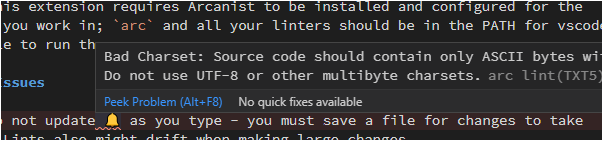

# Arcanist: A VSCode Extension

An extension for getting some of [Phabricator/Arcanist](https://phacility.com/phabricator/)
features integrated with Visual Studio Code.

## Features

* Show arc-lint notes in editor

* Recognize Arcanist files as JSON

## Requirements

This extension requires Arcanist to be installed and configured for the
directory you work in; `arc` and all your linters should be in the PATH for vscode
to be able to run them. \
Only reasonably recent versions of Arcanist are supported.

## Known Issues

* Lints do not update as you type - you must save a file for changes to take
  effect. Lints also might drift when making large changes.
* Most lints only show up as 3-characters-squiggle, which is hard to see.\
  We suggest users install the `usernamehw.errorlens` extension.

## Disclaimers

This extension is not affiliated with, nor is it supported by,
[Phacility](https://phacility.com/) or the Phabricator project.
All trademarks are property of their respective owners.
